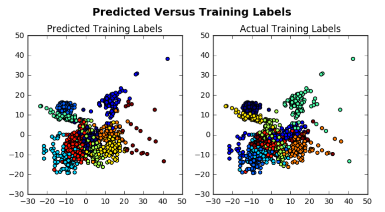
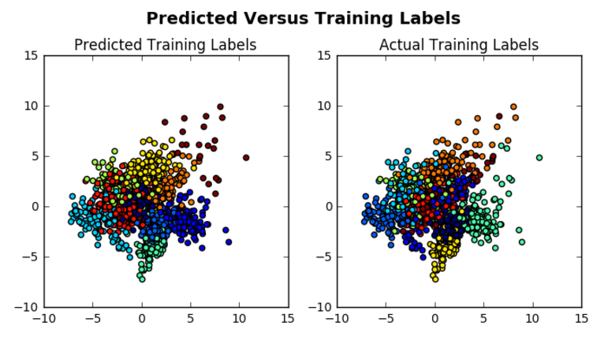
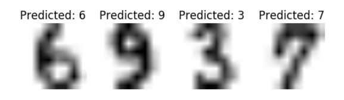

```{r, include=FALSE}
tutorial::go_interactive()
```

## 使用 Python 實作機器學習

機器學習是一門設計如何讓演算法能夠學習的電腦科學，讓機器能夠透過觀察已知的資料學習預測未知的資料。典型的應用包含概念學習（Concept learning）、函數學習（Function learning）、預測模型（Predictive modeling）、分群（Clustering）與找尋預測特徵（Finding predictive patterns）。終極目標是讓電腦能夠自行提升學習能力，預測未知資料的準確性能夠隨著已知資料的增加而提高，節省使用者人工調整校正的精力。

機器學習跟知識發掘（Knowledge Discovery）、資料採礦（Data Mining）、人工智慧（Artificial Intelligence, AI）以及統計（Statistics）有著密不可分的關係，應用範圍從學術研究到商業應用，從機器人科學家到垃圾郵件篩選與推薦系統，都可見其蹤影。

要成為一個優秀的資料科學家，機器學習是不可或缺的技能，這份教學會從零開始介紹如何使用 Python 來實作機器學習，並且示範如何使用一些非監督式與監督式的機器學習演算法。如果您對於使用 R 語言來實作機器學習更有興趣，可以參閱 [Machine Learning with R for Beginners tutorial](https://www.datacamp.com/community/tutorials/machine-learning-in-r)。

### 讀入資料

跟任何的資料科學專案相同，我們在教學的一開始就是將資料讀入 Python 的開發環境。如果您是一位機器學習的初學者，我們推薦三個很棒的資料來源，分別是[加州大學 Irvine 分校的機器學習資料集](http://archive.ics.uci.edu/ml/datasets)、[Kaggle 網站](www.kaggle.com)與 [KD Nuggets 整理的資料集資源](http://www.kdnuggets.com/datasets/index.html)。

好，讓我們來暖身一下，利用 Python 的機器學習套件 scikit-learn 將一個叫作 `digits` 的資料讀入。

**冷知識：**scikit-learn 源於於 SciPy，事實上 [scikit 有很多個](https://scikits.appspot.com/scikits)，我們使用的 scikit-learn 套件是專門用來實作機器學習以及資料採礦的，這也是為什麼使用 learn 來命名:)

我們首先由 `sklearn` 套件載入 `datasets` 模組，然後使用 `datasets` 模組的 `load_digits()` 方法來輸入資料，試著依照註解的提示完成程式後點選 **Run** 觀察結果，如果沒有頭緒，可以點選 **Solution** 將程式完成後再點選 **Run** 觀察結果：

```{python ex="scikit_load", type="sample-code"}
# Import `datasets` from `sklearn`
from sklearn import ________

# Load in the `digits` data
digits = datasets.load_digits()

# Print the `digits` data 
print(______)
```

```{python ex="scikit_load", type="solution"}
# Import `datasets` from `sklearn`
from sklearn import datasets

# Load in the `digits` data
digits = datasets.load_digits()

# Print the `digits` data 
print(digits)
```

```{python ex="scikit_load", type="sct"}
import_msg="Did you import `datasets` from `sklearn`?"
incorrect_import_msg="Don't forget to import the `datasets` module from `sklearn`!"
not_called_msg="Did you use `datasets.load_digits()` to load in the `digits` data?"
incorrect_msg="Use `datasets.load_digits()` to load in the `digits` data!"
predef_msg="Did you call the `print()` function?"
test_import("sklearn.datasets", same_as = True, not_imported_msg = import_msg, incorrect_as_msg = incorrect_import_msg)
test_function("sklearn.datasets.load_digits", not_called_msg = not_called_msg, incorrect_msg = incorrect_msg)
# Test `print()` function
test_function(
    "print",
    not_called_msg=predef_msg,
    incorrect_msg=predef_msg,
    do_eval=False
)
success_msg="Perfect! You're ready to go!"
```

`datasets` 模組還有其他讀取資料的方法，您也可以用它來產生虛擬資料。我們現在所使用的資料集 `digits` 也可以從加州大學 Irvine 分校的機器學習資料集載入，您可以在[這個連結](http://archive.ics.uci.edu/ml/machine-learning-databases/optdigits/)找到。假如您想要從加州大學 Irvine 分校的機器學習資料集載入 `digits`，讀入資料的程式寫法會變得像這樣，試著依照註解的提示完成程式後點選 **Run** 觀察結果，如果沒有頭緒，可以點選 **Solution** 將程式完成後再點選 **Run** 觀察結果：

```{python ex="pandas_load", type="sample-code"}
# Import the `pandas` library as `pd`
import ______ as __

# Load in the data with `read_csv()`
digits = pd.read_csv("http://archive.ics.uci.edu/ml/machine-learning-databases/optdigits/optdigits.tra", header=None)

# Print out `digits`
print(______)
```

```{python ex="pandas_load", type="solution"}
# Import the `pandas` library as `pd`
import pandas as pd

# Load in the data with `read_csv()`
digits = pd.read_csv("http://archive.ics.uci.edu/ml/machine-learning-databases/optdigits/optdigits.tra", header=None)

# Print out `digits`
print(digits)
```

```{python ex="pandas_load", type="sct"}
import_msg="Did you add some code to import `pandas` as `pd`?"
incorrect_import_msg="Don't forget to import the 'pandas' library as `pd`!"
csv_msg="Did you use the `read_csv()` method from pandas to load in the data?"
csv_incorrect_msg="Use `read_csv()` from the pandas library to load in the data "
predef_msg="Did you call the `print()` function?"
# Test import `pandas`
test_import("pandas", same_as = True, not_imported_msg = import_msg, incorrect_as_msg = incorrect_import_msg)
# Test `read_csv()`
test_function("pandas.read_csv", not_called_msg = csv_msg, incorrect_msg = csv_incorrect_msg)
# Test `print()` function
test_function(
    "print",
    not_called_msg=predef_msg,
    incorrect_msg=predef_msg,
    do_eval=False
)
success_msg("Awesome job!")
```

值得注意的是，從檔名的 `.tra` 與 `.tes` 可以得知，加州大學 Irvine 分校的機器學習資料集已經切分好訓練與測試資料，而上面這段程式中我們只讀入了訓練資料，如果要實作機器學習則還需要再讀入測試資料，

**秘訣：**想學習更多使用 Python 的 Pandas 套件來讀入與整理資料的技巧，可以參閱 [Importing Data in Python course](https://www.datacamp.com/courses/importing-data-in-python-part-1)。

### 探索資料

仔細閱讀資料的文件或描述是很好的習慣，加州大學 Irvine 分校的機器學習資料集針對每個資料都有提供文件，閱讀文件可以提高我們對資料的瞭解程度。然而光是初步認識還是略嫌不足，接著我們要進行的是探索性分析（Exploratory data analysis），我們又該從何開始探索這些手寫數字圖片資料呢？

#### 搜集基本資訊

假如我們直接透過 scikit-learn 讀入 `digits` 資料，那麼不同於加州大學 Irvine 分校的機器學習資料集在網頁中提供描述或文件，我們必須另外透過使用 `digits` 的屬性與方法來搜集基本資訊。

我們將透過 `digits` 的 `keys()` 方法來得知有哪些基本資訊可以搜集；透過 `data` 屬性觀察預測變數；透過 `target` 屬性觀察目標變數；透過 `DESCR` 屬性閱讀資料的描述文件。試著依照註解的提示完成程式後點選 **Run** 觀察結果，如果沒有頭緒，可以點選 **Solution** 將程式完成後再點選 **Run** 觀察結果：

```{python ex="digits", type="pre-exercise-code"}
from sklearn import datasets
digits = datasets.load_digits()
```

```{python ex="digits", type="sample-code"}
# Get the keys of the `digits` data
print(digits.______)

# Print out the data
print(digits.____)

# Print out the target values
print(digits.______)

# Print out the description of the `digits` data
print(digits.DESCR)
```

```{python ex="digits", type="solution"}
# Get the keys of the `digits` data
print(digits.keys())

# Print out the data
print(digits.data)

# Print out the target values
print(digits.target)

# Print out the description of the `digits` data
print(digits.DESCR)
```

```{python ex="digits", type="sct"}
# Test `print` 
test_function(
    "print",
    1,
    not_called_msg="Did you print out the keys of `digits`?",
    incorrect_msg="Don't forget to print out the keys of `digits`!",
    do_eval=False
)
# Test `print`
test_function(
    "print",
    2,
    not_called_msg="Did you print out the data?",
    incorrect_msg="Don't forget to print out the data!",
    do_eval=False
)
# Test `print`
test_function(
    "print",
    3,
    not_called_msg="Did you print out the target values of the data?",
    incorrect_msg="Don't forget to print out the target values of the data!",
    do_eval=False
)
# Test `print` 
test_function(
    "print",
    4,
    not_called_msg="Did you print out the description of `digits`?",
    incorrect_msg="Don't forget to print out the description of `digits`!",
    do_eval=False
)
success_msg("Awesome!")
```

接著我們回憶一下在第一個練習中印出的 `digits`，裡頭出現很多的 `numpy` 陣列，了解陣列最重要的特性是形狀（shape）。假如我們有一個 3d 陣列：`y = np.zeros((2, 3, 4))`，這個陣列的形狀就是 `(2,3,4)`，由整數組成的 tuple 資料結構。

我們延續前一個練習來觀察 `data`、`target`、`DESCR` 與 `images` 的形狀，利用 `digits` 的 `data` 屬性將這個陣列獨立指派給 `digits_data` 並檢視其 `shape` 屬性，並且對另外三個屬性也依樣畫葫蘆進行相同的操作，試著依照註解的提示完成程式後點選 **Run** 觀察結果，如果沒有頭緒，可以點選 **Solution** 將程式完成後再點選 **Run** 觀察結果：

```{python ex="digits_shape", type="pre-exercise-code"}
from sklearn import datasets
import numpy as np
digits = datasets.load_digits()
```

```{python ex="digits_shape", type="sample-code"}
# Isolate the `digits` data
digits_data = digits.data

# Inspect the shape
print(digits_data.shape)

# Isolate the target values with `target`
digits_target = digits.______

# Inspect the shape
print(digits_target._____)

# Print the number of unique labels
number_digits = len(np.unique(digits.target))

# Isolate the `images`
digits_images = digits.images

# Inspect the shape
print(digits_images.shape)
```

```{python ex="digits_shape", type="solution"}
# Isolate the `digits` data
digits_data = digits.data

# Inspect the shape
print(digits_data.shape)

# Isolate the target values with `target`
digits_target = digits.target

# Inspect the shape
print(digits_target.shape)

# Print the number of unique labels
number_digits = len(np.unique(digits.target))

# Isolate the `images`
digits_images = digits.images

# Inspect the shape
print(digits_images.shape)
```

```{python ex="digits_shape", type="sct"}
msg_data="Did you add `shape` to get the number of dimensions and items of the `digits_data` array?"
msg_target="Did you add `shape` to get the number of dimensions and items of the `digits_target` array?"
msg_image="Did you add `shape` to get the number of dimensions and items of the `digits_images` array?"
# Test object `digits_data`
test_object("digits_data", undefined_msg="Did you define the `digits_data` object?", incorrect_msg="Did you use the `data` attribute to isolate the data of `digits`?")
# Test object `digits_target`
test_object("digits_target", undefined_msg="Did you define the `digits_target` object?", incorrect_msg="Did you use the `target` attribute to isolate the target values of the `digits` data?")
# Test `shape` of `digits_data`
#test function print
test_function(
    "print",
    1,
    not_called_msg="Did you print out the shape of thedata?",
    incorrect_msg="Don't forget to print out the shape of the data!",
    do_eval=False
)
test_object_accessed("digits_data.shape", not_accessed_msg=msg_data)
# Test `print`
test_function(
    "print",
    2,
    not_called_msg="Did you print out the shape of the target values of the data?",
    incorrect_msg="Don't forget to print out the shape of the target values of the data!",
    do_eval=False
)
# Test access `shape` of `digits_target`
test_object_accessed("digits_target.shape", not_accessed_msg=msg_target)
# Test object `number_digits`
test_object("number_digits", undefined_msg="Did you define the `number_digits` object?", incorrect_msg="Did you use `np.unique()` to give back the unique target values? Don't forget to give back the length of this array with `len()`!")
# Test object `digits_images`
test_object("digits_images", undefined_msg="Did you define the `digits_images` object?", incorrect_msg="Did you use the `images` attribute to isolate the images of the `digits` data?")
# Test `shape` of `digits_images`
test_object_accessed("digits_images.shape", not_accessed_msg=msg_image)
# Test `print` 
test_function(
    "print",
    3,
    not_called_msg="Did you print out the shape of the images of `digits`?",
    incorrect_msg="Don't forget to print out the shape of the images of `digits`!",
    do_eval=False
)
success_msg("Well done!")
```

我們在這小結一下，檢視 `digits.data.shape` 可以得知資料有 1,797 個觀測值，64 個變數，檢視 `digits.target.shape` 可以得知資料有 1,797 個目標值（或稱標籤值），而檢視 `len(np.unique(digits.target))` 可以得知所有的目標值只有 10 個相異值：0 到 9，意即我們的模型是要辨識手寫數字圖片是 0 到 9 中的哪一個數字。

最後是 `digits.images` 的三個維度：1,797 個 8 x 8 像素的矩陣，我們可以進一步將 `digits.images` 轉換（reshape）為兩個維度，並且使用 `numpy` 的 `all()` 方法比較陣列內的元素是否與 `digits.data` 完全相同：`print(np.all(digits.images.reshape((1797,64)) == digits.data))`，而我們會得到 `True` 的結果。

#### 使用 `matplotlib` 視覺化手寫數字圖片

接下來我們要使用 Python 的資料視覺化套件 [matplotlib](http://matplotlib.org/) 來視覺化這些手寫數字圖片：

```
# 從 `sklearn` 載入 `datasets`
from sklearn import datasets
# 載入 matplotlib
import matplotlib.pyplot as plt

# 載入 `digits`
digits = datasets.load_digits()

# 設定圖形的大小（寬, 高）
fig = plt.figure(figsize=(4, 2))

# 調整子圖形 
fig.subplots_adjust(left=0, right=1, bottom=0, top=1, hspace=0.05, wspace=0.05)

# 把前 8 個手寫數字顯示在子圖形
for i in range(8):
    # 在 2 x 4 網格中第 i + 1 個位置繪製子圖形，並且關掉座標軸刻度
    ax = fig.add_subplot(2, 4, i + 1, xticks = [], yticks = [])
    # 顯示圖形，色彩選擇灰階
    ax.imshow(digits.images[i], cmap = plt.cm.binary)
    # 在左下角標示目標值
    ax.text(0, 7, str(digits.target[i]))

# 顯示圖形
plt.show()
```

這段程式看起來有點難懂，讓我們分開來看：

- 載入 `matplotlib` 套件。
- 設定一個長 2 吋，寬 4 吋的空白畫布，準備待會將子圖形畫在上面。
- 調整子圖形的一些參數。
- 使用一個 `for` 迴圈開始要將空白畫布填滿。
- 初始化 8 個子圖形，並依序填入 2 x 4 網格中的每一格。
- 最後畫龍點睛的部分是在每個子圖形 (0, 7) 的位置（左下角）顯示目標值。
- 別忘了使用 `plt.show()` 將畫好的圖顯示出來！

完成後我們可以看到這張視覺化圖形：


或者採取這段較簡潔的程式：

```
# 從 `sklearn` 載入 `datasets`
from sklearn import datasets
# 載入 matplotlib
import matplotlib.pyplot as plt

# 載入 `digits`
digits = datasets.load_digits()

# 將觀測值與目標值放入一個 list
images_and_labels = list(zip(digits.images, digits.target))

# list 中的每個元素
for i, (image, label) in enumerate(images_and_labels[:8]):
    # 在 i + 1 的位置初始化子圖形
    plt.subplot(2, 4, i + 1)
    # 關掉子圖形座標軸刻度
    plt.axis('off')
    # 顯示圖形，色彩選擇灰階
    plt.imshow(image, cmap = plt.cm.binary)
    # 加入子圖形的標題
    plt.title('Training: ' + str(label))

# 顯示圖形
plt.show()
```

完成後我們可以看到這張視覺化圖形：


在這個例子中，我們將兩個陣列存入 `images_and_labels` 這個變數，然後將這個變數中的前 8 個元素（包含 `digits.images` 與相對應的 `digits.target`）在一個 2 x 4 的格線上繪製子圖形，並且使用 `plt.cm.binary` 這個灰階色彩，搭配子圖形標題顯示出來。

經過這兩個視覺化練習之後，您應該對目前手上處理的 `digits` 資料有更深的認識！

#### 視覺化：主成份分析（Principal Component Analysis, PCA）

`digits` 資料有 64 個變數，面對這種高維度的資料（實務上還有其他很多像是財務或者氣候資料也都屬於高維度資料），我們需要用一些方法找出特別重要的二到三個變數，或者將許多的變數組合成讓我們更容易理解且視覺化的幾個維度。

這種方法稱作降維（Dimensionality Reduction），我們接著要使用其中一種方法稱為：主成份分析（Principal Component Analysis, PCA）來協助我們視覺化 `digits` 資料。主成份分析的精神在於找出變數之間的線性關係組成新的一個主成份，然後使用這個主成份取代原有的變數，屬於一種最大化資料變異性的線性轉換方法，如果您想了解更多，可以參閱這個[連結](http://www.lauradhamilton.com/introduction-to-principal-component-analysis-pca)。

我們可以透過 scikit-learn 輕鬆對 `digits` 資料實作主成份分析，直接點選 **Run** 觀察結果：

```{python ex="pca", type="pre-exercise-code"}
from sklearn import datasets
digits = datasets.load_digits()
from sklearn.decomposition import RandomizedPCA
from sklearn.decomposition import PCA
import numpy as np
```

```{python ex="pca", type="sample-code"}
# Create a Randomized PCA model that takes two components
randomized_pca = RandomizedPCA(n_components=2)

# Fit and transform the data to the model
reduced_data_rpca = randomized_pca.fit_transform(digits.data)

# Create a regular PCA model 
pca = PCA(n_components=2)

# Fit and transform the data to the model
reduced_data_pca = pca.fit_transform(digits.data)

# Inspect the shape
print("Shape of reduced_data_pca:", reduced_data_pca.shape)
print("---")

# Print out the data
print("RPCA:")
print(reduced_data_rpca)
print("---")
print("PCA:")
print(reduced_data_pca)
```

```{python ex="pca", type="solution"}
# Create a Randomized PCA model that takes two components
randomized_pca = RandomizedPCA(n_components=2)

# Fit and transform the data to the model
reduced_data_rpca = randomized_pca.fit_transform(digits.data)

# Create a regular PCA model 
pca = PCA(n_components=2)

# Fit and transform the data to the model
reduced_data_pca = pca.fit_transform(digits.data)

# Inspect the shape
print("Shape of reduced_data_pca:", reduced_data_pca.shape)
print("---")

# Print out the data
print("RPCA:")
print(reduced_data_rpca)
print("---")
print("PCA:")
print(reduced_data_pca)
```

```{python ex="pca", type="sct"}
test_object("randomized_pca", do_eval=False)
test_object("reduced_data_rpca", do_eval=False)
test_object("pca", do_eval=False)
test_object("reduced_data_pca", do_eval=False)
predef_msg="Did you inspect the shape of `reduced_data_pca`?"
test_object_accessed("reduced_data_pca.shape", not_accessed_msg=predef_msg)
# Test `print` 
test_function(
    "print",
    1,
    not_called_msg="Did you print out the `reduced_data_rpca` data?",
    incorrect_msg="Don't forget to print out the `reduced_data_rpca` data!",
    do_eval=False
)
test_function(
    "print",
    2,
    not_called_msg="Did you print out the `reduced_data_pca` data?",
    incorrect_msg="Don't forget to print out the `reduced_data_pca` data!",
    do_eval=False
)
success_msg("Amazing!")
```

**秘訣：**比較 `RandomizedPCA()` 與 `PCA()` 產生的結果，觀察兩者的差異。

我們在程式中指定降維成兩個主成份，確保可以使用散佈圖視覺化，並觀察用兩個主成份是否可以將不同的目標值區隔開：

```
from sklearn import datasets
digits = datasets.load_digits()
import matplotlib.pyplot as plt

colors = ['black', 'blue', 'purple', 'yellow', 'white', 'red', 'lime', 'cyan', 'orange', 'gray']
for i in range(len(colors)):
    x = reduced_data_rpca[:, 0][digits.target == i]
    y = reduced_data_rpca[:, 1][digits.target == i]
    plt.scatter(x, y, c=colors[i])
plt.legend(digits.target_names, bbox_to_anchor=(1.05, 1), loc=2, borderaxespad=0.)
plt.xlabel('First Principal Component')
plt.ylabel('Second Principal Component')
plt.title("PCA Scatter Plot")
plt.show()
```

完成後我們可以看到這張視覺化圖形：


我們再一次使用了 matplotlib 來繪圖，假如您正在製作自己的資料科學作品集，也許可以考慮更高階且更美觀的繪圖套件。另外如果您使用 Jupyter Notebook 進行開發，不需要執行 `plt.show()`，如果您對 Jupyter Notebook 有興趣可以參閱 [Definitive Guide to Jupyter Notebook](https://www.datacamp.com/community/tutorials/tutorial-jupyter-notebook)。

讓我們分開來看前一段程式碼：

1. 將不同的顏色儲存在一個 list 中。
由於相異的目標值有 10 個（0 到 9），所以我們指定了 10 種不同的顏色來標示。
2. 設定 `x` 軸與 `y` 軸。
分別選出 `reduced_data_rpca` 的第一欄與第二欄，根據不同的目標值選出對應的觀測值，意即當迴圈開始的時候，會選出目標值為 `0` 的觀測值，接著是目標值為 `1` 的觀測值，依此類推。
3. 畫出散佈圖。
當迴圈開始的時候，會將目標值為 `0` 的觀測值用黑色（`black`）畫出，接著是將目標值為 `1` 的觀測值用藍色（`blue`）畫出，依此類推。
4. 使用 `target_names` 鍵值在散佈圖旁邊加上圖例。
5. 加入圖形標題與座標軸標籤。
6. 顯示圖形。

### 下一步呢？

在對資料本身有了一定認知後，我們必須思索的是如何應用，以及使用什麼樣的機器學習演算法來建立預測模型。

**秘訣：**對資料的認知程度愈高，愈容易找到應用與合適的機器學習演算法。

然而對於 scikit-learn 的初學者來說，這個套件的內容有點過於龐大，這時您可以參考[ scikit-learn 機器學習地圖](http://scikit-learn.org/stable/tutorial/machine_learning_map/)來獲得額外的幫助。

我們想要對 `digits` 資料使用非監督式學習演算法，在這個機器學習地圖上我們沿著資料超過 50 個觀測值（**確認！**）、預測類別（**確認！**）、沒有目標值（只要不使用 `digits.target` 即可，**確認！**）、需要知道有幾個類別要預測（**確認！**）以及需要小於 1 萬個觀測值（**確認！**），我們可以順利應用 K-Means！

但是 K-Means 演算法究竟是什麼？K-Means 演算法是最簡單且最廣泛被運用來解決分群問題的非監督式學習演算法。演算法首先隨意設定 `k` 個中心點，然後計算各個觀測值與這 `k` 個中心點的距離，然後將觀測值分配給距離最近的中心點貼上標籤，形成 `k` 個群集。接著這 `k` 個中心點的位置會被重新計算並移動到各個群集目前的中心，然後再重新計算各個觀測值與這 `k` 個中心點的距離，更新各個觀測值的群集標籤。前述的流程會重複進行，一直到各個觀測值的群集標籤穩定不更動為止。`k` 值由使用者指定，而一開始這 `k` 個中心點的位置則是隨機擺放，這些隨機擺放的位置會影響 K-Means 演算法的結果，可以透過設定 `n-init` 參數來處理這個問題。

### 資料的預處理

在開始使用 K-Means 演算法之前，我們應該先學習關於資料的預處理（Preprocessing）。

#### 資料的標準化

我們使用 `sklearn.preprocessing` 模組的 `scale()` 方法將 `digits` 資料作標準化，試著依照註解的提示完成程式後點選 **Run** 觀察結果，如果沒有頭緒，可以點選 **Solution** 將程式完成後再點選 **Run** 觀察結果：

```{python ex="normalization", type="pre-exercise-code"}
from sklearn import datasets
digits = datasets.load_digits()
```

```{python ex="normalization", type="sample-code"}
# Import
from sklearn.preprocessing import scale

# Apply `scale()` to the `digits` data
data = _____(digits.data)
```

```{python ex="normalization", type="solution"}
# Import
from sklearn.preprocessing import scale

# Apply `scale()` to the `digits` data
data = scale(digits.data)
```

```{python ex="normalization", type="sct"}
test_function(
    "sklearn.preprocessing.scale",
    not_called_msg="Did you standardize the `digits` data?",
    incorrect_msg="Don't forget to standardize the `digits` data with `scale()`!",
    do_eval=False
)
success_msg("Awesome!")
```

透過標準化，我們將這 64 個維度的分佈轉換為平均數為 0，標準差為 1 的標準常態分佈。

#### 將資料切分為訓練與測試資料

為了之後要評估模型的表現，我們也需要將資料切分為訓練與測試資料，訓練資料是用來建立模型，測試資料則用來評估模型。實務中兩個資料不會有交集，常見的切分比例是 2/3 作為訓練資料，1/3 作為測試資料。

在接下來的程式我們將 `train_test_split()` 方法中的 `test_size` 參數設為 `0.25`，另外一個參數 `random_state` 設為 `42` 用來確保每次切分資料的結果都相同，如果您希望產出可複製的結果，這是非常實用的技巧。試著依照註解的提示完成程式後點選 **Run** 觀察結果，如果沒有頭緒，可以點選 **Solution** 將程式完成後再點選 **Run** 觀察結果：

```{python ex="train_test_split", type="pre-exercise-code"}
from sklearn import datasets
digits = datasets.load_digits()
from sklearn.preprocessing import scale
data = scale(digits.data)
```

```{python ex="train_test_split", type="sample-code"}
# Import `train_test_split`
from sklearn.cross_validation import ________________

# Split the `digits` data into training and test sets
X_train, X_test, y_train, y_test, images_train, images_test = train_test_split(data, digits.target, digits.images, test_size=0.25, random_state=42)
```

```{python ex="train_test_split", type="solution"}
# Import `train_test_split`
from sklearn.cross_validation import train_test_split

# Split the `digits` data into training and test sets
X_train, X_test, y_train, y_test, images_train, images_test = train_test_split(data, digits.target, digits.images, test_size=0.25, random_state=42)
```

```{python ex="train_test_split", type="sct"}
import_msg="Did you import `train_test_split` from `sklearn.cross_validation`?"
predef_msg="Don't forget to fill in `train_test_split`!"
test_import("sklearn.cross_validation.train_test_split", same_as = True, not_imported_msg = import_msg, incorrect_as_msg = predef_msg)
test_object("X_train", do_eval=False,  undefined_msg="Did you leave out `X_train` or any of the other variables?")
test_object("X_test", do_eval=False, undefined_msg="Did you define `X_test`?")
test_object("y_train", do_eval=False, undefined_msg="Did you define `y_train`?")
test_object("y_test", do_eval=False, undefined_msg="Did you define `y_test`?")
test_object("images_train", do_eval=False, undefined_msg="Did you define `images_train`?")
test_object("images_test", do_eval=False, undefined_msg="Did you define `images_test`?")
success_msg("Great job!")
```

切分完訓練與測試資料之後，我們很快地看一下訓練資料的觀測值與目標值資訊，試著依照註解的提示完成程式後點選 **Run** 觀察結果，如果沒有頭緒，可以點選 **Solution** 將程式完成後再點選 **Run** 觀察結果：

```{python ex="inspect", type="pre-exercise-code"}
from sklearn import datasets
from sklearn.cross_validation import train_test_split
from sklearn.preprocessing import scale
import numpy as np
digits = datasets.load_digits()
data = scale(digits.data)
X_train, X_test, y_train, y_test, images_train, images_test = train_test_split(data, digits.target, digits.images, test_size=0.25, random_state=42)
```

```{python ex="inspect", type="sample-code"}
# Number of training features
n_samples, n_features = X_train.shape

# Print out `n_samples`
print(_________)

# Print out `n_features`
print(__________)

# Number of Training labels
n_digits = len(np.unique(y_train))

# Inspect `y_train`
print(len(_______))
```

```{python ex="inspect", type="solution"}
# Number of training features
n_samples, n_features = X_train.shape

# Print out `n_samples`
print(n_samples)

# Print out `n_features`
print(n_features)

# Number of Training labels
n_digits = len(np.unique(y_train))

# Inspect `y_train`
print(len(y_train))
```

```{python ex="inspect", type="sct"}
test_object("n_samples", undefined_msg="did you leave out `n_samples` or `n_features`?")
test_object("n_features")
test_function(
    "print",
    1,
    not_called_msg="Did you print out the number of samples of the `digits` training data?",
    incorrect_msg="Don't forget to print out the number of samples!",
    do_eval=False
)
test_function(
    "print",
    2,
    not_called_msg="Did you print out the number of features of the `digits` training data?",
    incorrect_msg="Don't forget to print out the number of features!",
    do_eval=False
)
test_object("n_digits", incorrect_msg="did you define `n_digits` correctly?")
test_function(
    "print",
    3,
    not_called_msg="Did you print out the number of training labels for the `digits` data?",
    incorrect_msg="Don't forget to print out the number of training labels with `len(y_train)`!",
    do_eval=False
)
success_msg("Well done!")
```

現在訓練資料 `X_train` 有 1347 個觀測值，`y_train` 有 1347 個目標值，恰好是原始資料 `digits` 的 2/3；而`X_test` 有 450 個觀測值，`y_test` 有 450 個目標值，恰好是原始資料 `digits` 的 1/3。

### `digits` 資料的分群

經過標準化與切分之後，我們就可以開始使用 K-Means 演算法，透過 `cluster` 模組的 `KMeans()` 方法來建立模型，在這裡要注意三個參數：`init`、`n_clusters` 與 `random_state`。您一定還記得 `random_state`，這個參數能夠確保我們每次執行這段程式得到的結果相同，試著依照註解的提示完成程式後點選 **Run** 觀察結果，如果沒有頭緒，可以點選 **Solution** 將程式完成後再點選 **Run** 觀察結果：

```{python ex="kmeans_model", type="pre-exercise-code"}
from sklearn import datasets
from sklearn.cross_validation import train_test_split
from sklearn.preprocessing import scale
import numpy as np
digits = datasets.load_digits()
data = scale(digits.data)
X_train, X_test, y_train, y_test, images_train, images_test = train_test_split(data, digits.target, digits.images, test_size=0.25, random_state=42)
```

```{python ex="kmeans_model", type="sample-code"}
# Import the `cluster` module
from sklearn import ________

# Create the KMeans model
clf = cluster.KMeans(init='k-means++', n_clusters=10, random_state=42)

# Fit the training data `X_train`to the model
clf.fit(________)
```

```{python ex="kmeans_model", type="solution"}
# Import the `cluster` module
from sklearn import cluster

# Create the KMeans model
clf = cluster.KMeans(init='k-means++', n_clusters=10, random_state=42)

# Fit the training data to the model
clf.fit(X_train)
```

```{python ex="kmeans_model", type="sct"}
import_msg="Did you import `cluster` from `sklearn`?"
predef_msg="Don't forget to import `cluster from `sklearn`!"
test_import("sklearn.cluster", same_as = True, not_imported_msg = import_msg, incorrect_as_msg = predef_msg)
test_object("clf", do_eval=False, incorrect_msg="did create the KMeans model correctly?")
test_function("clf.fit", do_eval=False)
success_msg("Woohoo!")
```

`init` 參數指定我們使用的 K-Means 演算法 `k-means++`，`init` 參數預設就是使用 K-Means 演算法，所以這個參數其實是可以省略的。

`n_clusters` 參數被設定為 `10`，這呼應了我們有 0 到 9 這 10 個相異目標值。假使在未知群集的情況下，通常會嘗試幾個不同的 `n_clusters` 參數值，分別計算平方誤差和（Sum of the Squared Errors, SSE），然後選擇平方誤差和最小的那個 `n_clusters` 作為群集數，換句話說就是讓各個群集中的每個觀測值到群集中心點的距離最小化。

**再提醒一下**，不需要將測試資料放入模型中，測試資料是用來評估模型的表現。接著我們可以利用將各個群集的中心圖片視覺化：

```
# 建立 K-Means 模型
from sklearn import datasets
from sklearn.cross_validation import train_test_split
from sklearn.preprocessing import scale
import numpy as np
from sklearn import cluster

digits = datasets.load_digits()
data = scale(digits.data)
X_train, X_test, y_train, y_test, images_train, images_test = train_test_split(data, digits.target, digits.images, test_size=0.25, random_state=42)
clf = cluster.KMeans(init='k-means++', n_clusters=10, random_state=42)
clf.fit(X_train)

# 載入 matplotlib
import matplotlib.pyplot as plt

# 設定圖形的大小
fig = plt.figure(figsize=(8, 3))

# 圖形標題
fig.suptitle('Cluster Center Images', fontsize=14, fontweight='bold')

# 對所有的目標值（0 - 9）
for i in range(10):
    # 在 2x5 的網格上繪製子圖形
    ax = fig.add_subplot(2, 5, i + 1)
    # 顯示圖片
    ax.imshow(clf.cluster_centers_[i].reshape((8, 8)), cmap=plt.cm.binary)
    # 將座標軸刻度關掉
    plt.axis('off')

# 顯示圖形
plt.show()
```


接下來我們要預測測試資料的目標值，試著依照註解的提示完成程式後點選 **Run** 觀察結果，如果沒有頭緒，可以點選 **Solution** 將程式完成後再點選 **Run** 觀察結果：

```{python ex="predict", type="pre-exercise-code"}
from sklearn import datasets
from sklearn.cross_validation import train_test_split
from sklearn.preprocessing import scale
from sklearn import cluster
digits = datasets.load_digits()
data = scale(digits.data)
X_train, X_test, y_train, y_test, images_train, images_test = train_test_split(data, digits.target, digits.images, test_size=0.25, random_state=42)
clf = cluster.KMeans(init='k-means++', n_clusters=10, random_state=42)
clf.fit(X_train)
```

```{python ex="predict", type="sample-code"}
# Predict the labels for `X_test`
y_pred=clf.predict(X_test)

# Print out the first 100 instances of `y_pred`
print(y_pred[:100])

# Print out the first 100 instances of `y_test`
print(y_test[:100])

# Study the shape of the cluster centers
clf.cluster_centers_._____
```

```{python ex="predict", type="solution"}
# Predict the labels for `X_test`
y_pred=clf.predict(X_test)

# Print out the first 100 instances of `y_pred`
print(y_pred[:100])

# Print out the first 100 instances of `y_test`
print(y_test[:100])

# Study the shape of the cluster centers
clf.cluster_centers_.shape
```

```{python ex="predict", type="sct"}
test_object("y_pred")
test_function(
    "print",
    1,
    not_called_msg="Did you print out the first 100 instances of `y_pred`?",
    incorrect_msg="Don't forget to print out the first 100 instances of `y_pred`!",
    do_eval=False
)
test_function(
    "print",
    2,
    not_called_msg="Did you print out the first 100 instances of `y_test`?",
    incorrect_msg="Don't forget to print out the first 100 instances of `y_test`!",
    do_eval=False
)
msg_data="Did you fill in `shape` to print out the shape of the cluster centers?"
test_object_accessed("clf.cluster_centers_.shape", not_accessed_msg=msg_data)
success_msg="Awesome!"
```

在上述的程式中，我們預測 450 筆測試資料的目標值並將結果儲存於 `y_pred` 之中，接著將 `y_pred` 與 `y_test` 的前 100 個元素印出，很快就可以看到一些結果，知道哪幾個觀測值預測正確，哪幾個觀測值預測錯誤。

接著我們來將預測的目標值視覺化：

```
# 建立 K-Means 模型
from sklearn import datasets
from sklearn.cross_validation import train_test_split
from sklearn.preprocessing import scale
import numpy as np
from sklearn import cluster
# 載入 `Isomap()`
from sklearn.manifold import Isomap

digits = datasets.load_digits()
data = scale(digits.data)
X_train, X_test, y_train, y_test, images_train, images_test = train_test_split(data, digits.target, digits.images, test_size=0.25, random_state=42)
clf = cluster.KMeans(init='k-means++', n_clusters=10, random_state=42)
clf.fit(X_train)

# 使用 Isomap 對 `X_train` 資料降維
X_iso = Isomap(n_neighbors=10).fit_transform(X_train)

# 使用 K-Means 演算法
clusters = clf.fit_predict(X_train)

# 在 1x2 的網格上繪製子圖形
fig, ax = plt.subplots(1, 2, figsize=(8, 4))

# 調整圖形的外觀
fig.suptitle('Predicted Versus Training Labels', fontsize=14, fontweight='bold')
fig.subplots_adjust(top=0.85)

# 加入散佈圖 
ax[0].scatter(X_iso[:, 0], X_iso[:, 1], c=clusters)
ax[0].set_title('Predicted Training Labels')
ax[1].scatter(X_iso[:, 0], X_iso[:, 1], c=y_train)
ax[1].set_title('Actual Training Labels')

# 顯示圖形
plt.show()
```

這次我們改用 `Isomap()` 來對 `digits` 資料進行降維，跟主成份分析不同的地方是 Isomap 屬於非線性的降維方法。



**秘訣：**改用主成份分析重新執行上面的程式，並觀察跟 Isomap 有什麼差異:

```
# 建立 K-Means 模型
from sklearn import datasets
from sklearn.cross_validation import train_test_split
from sklearn.preprocessing import scale
import numpy as np
from sklearn import cluster
# 載入 `PCA()`
from sklearn.decomposition import PCA

# 使用 PCA 對 `X_train` 資料降維
X_pca = PCA(n_components=2).fit_transform(X_train)

# 使用 K-Means 演算法
clusters = clf.fit_predict(X_train)

# 在 1x2 的網格上繪製子圖形
fig, ax = plt.subplots(1, 2, figsize=(8, 4))

# 調整圖形的外觀
fig.suptitle('Predicted Versus Training Labels', fontsize=14, fontweight='bold')
fig.subplots_adjust(top=0.85)

# 加入散佈圖 
ax[0].scatter(X_pca[:, 0], X_pca[:, 1], c=clusters)
ax[0].set_title('Predicted Training Labels')
ax[1].scatter(X_pca[:, 0], X_pca[:, 1], c=y_train)
ax[1].set_title('Actual Training Labels')

# 顯示圖形
plt.show()
```



我們發現 K-Means 演算法的效果可能不是很好，但還需要更進一步評估。

### 評估分群模型的表現

評估模型的表現是機器學習很重要的課題，我們首先將混淆矩陣（Confusion matrix）印出，試著依照註解的提示完成程式後點選 **Run** 觀察結果，如果沒有頭緒，可以點選 **Solution** 將程式完成後再點選 **Run** 觀察結果：

```{python ex="confusion", type="pre-exercise-code"}
from sklearn import datasets
from sklearn.cross_validation import train_test_split
from sklearn.preprocessing import scale
from sklearn import cluster
digits = datasets.load_digits()
data = scale(digits.data)
X_train, X_test, y_train, y_test, images_train, images_test = train_test_split(data, digits.target, digits.images, test_size=0.25, random_state=42)
clf = cluster.KMeans(init='k-means++', n_clusters=10, random_state=42)
clf.fit(X_train)
y_pred=clf.predict(X_test)
```

```{python ex="confusion", type="sample-code"}
# Import `metrics` from `sklearn`
from sklearn import _______

# Print out the confusion matrix with `confusion_matrix()`
print(metrics.confusion_matrix(y_test, y_pred))
```

```{python ex="confusion", type="solution"}
# Import `metrics` from `sklearn`
from sklearn import metrics

# Print out the confusion matrix with `confusion_matrix()`
print(metrics.confusion_matrix(y_test, y_pred))
```

```{python ex="confusion", type="sct"}
test_import("sklearn.metrics", same_as = True, not_imported_msg = "Did you import `metrics` from `sklearn`?", incorrect_as_msg = "Don't forget to import `metrics` from `sklearn`!")
test_function(
    "print",
    not_called_msg="Did you print out the confusion matrix?",
    incorrect_msg="Don't forget to print out the confusion matrix!",
    do_eval=False
)
success_msg="Well done! Now, what do the results tell you?"
```

我們可以看到 41 個 `5` 被正確預測，11 個 `8` 被正確預測，但混淆矩陣並不是唯一的評估方式，還有非常多的評估指標可以參考，直接點選 **Run** 觀察結果：

```{python ex="clustering_performance", type="pre-exercise-code"}
from sklearn import datasets
from sklearn.cross_validation import train_test_split
from sklearn.preprocessing import scale
from sklearn import cluster
from sklearn.metrics import homogeneity_score, completeness_score, v_measure_score, adjusted_rand_score, adjusted_mutual_info_score, silhouette_score
digits = datasets.load_digits()
data = scale(digits.data)
X_train, X_test, y_train, y_test, images_train, images_test = train_test_split(data, digits.target, digits.images, test_size=0.25, random_state=42)
clf = cluster.KMeans(init='k-means++', n_clusters=10, random_state=42)
clf.fit(X_train)
y_pred=clf.predict(X_test)
```

```{python ex="clustering_performance", type="sample-code"}
from sklearn.metrics import homogeneity_score, completeness_score, v_measure_score, adjusted_rand_score, adjusted_mutual_info_score, silhouette_score
print('% 9s' % 'inertia    homo   compl  v-meas     ARI AMI  silhouette')
print('%i   %.3f   %.3f   %.3f   %.3f   %.3f    %.3f'
          %(clf.inertia_,
      homogeneity_score(y_test, y_pred),
      completeness_score(y_test, y_pred),
      v_measure_score(y_test, y_pred),
      adjusted_rand_score(y_test, y_pred),
      adjusted_mutual_info_score(y_test, y_pred),
      silhouette_score(X_test, y_pred, metric='euclidean')))
```

這些指標包含了：

- Homogeneity score
- Completeness score
- V-measure score
- Adjusted rand score
- Adjusted Mutual Info score, AMI score
- Silhouette score

但這些評估指標都不是太好，像是 silhouette score 接近 0，代表很多的觀測值都接近分群邊界而可能被分到錯誤的群集中；而 ARI 則告訴我們同一群集中的觀測值沒有完全相同；Completeness score 則告訴我們一定有觀測值被分在錯誤的群集。

這提示我們針對 `digits` 資料也許應該嘗試另外一種演算法。

### 嘗試另外一種演算法：支持向量機（Support Vector Machines, SVM）

當訓練資料沒有目標值的時候適用前述的分群演算法，當訓練資料具有目標值的時候就能夠適用分類演算法。我們再回顧一下 scikit-learn 機器學習地圖，在分類演算的區域第一個看到的是線性 SVC，讓我們對 `digits` 資料使用這個演算法試試看，直接點選 **Run** 觀察結果：

```{python ex="svm", type="pre-exercise-code"}
from sklearn import datasets
from sklearn.preprocessing import scale
from sklearn import cluster
digits = datasets.load_digits()
data = scale(digits.data)
```

```{python ex="svm", type="sample-code"}
# Import `train_test_split`
from sklearn.cross_validation import train_test_split

# Split the data into training and test sets 
X_train, X_test, y_train, y_test, images_train, images_test = train_test_split(digits.data, digits.target, digits.images, test_size=0.25, random_state=42)

# Import the `svm` model
from sklearn import svm

# Create the SVC model 
svc_model = svm.SVC(gamma=0.001, C=100., kernel='linear')

# Fit the data to the SVC model
svc_model.fit(X_train, y_train)
```

```{python ex="svm", type="solution"}
# Import `train_test_split`
from sklearn.cross_validation import train_test_split

# Split the data into training and test sets 
X_train, X_test, y_train, y_test, images_train, images_test = train_test_split(digits.data, digits.target, digits.images, test_size=0.25, random_state=42)

# Import the `svm` model
from sklearn import svm

# Create the SVC model 
svc_model = svm.SVC(gamma=0.001, C=100., kernel='linear')

# Fit the data to the SVC model
svc_model.fit(X_train, y_train)
```

```{python ex="svm", type="sct"}
test_import("sklearn.cross_validation.train_test_split", same_as = True, not_imported_msg = "Did you import `train_test_split` from `sklearn.cross_validation`?", incorrect_as_msg = "Don't forget to import `train_test_split` from `sklearn.cross_validation`!")
test_object("X_train", do_eval=False, undefined_msg="did you define `X_train`?")
test_object("X_test", do_eval=False, undefined_msg="did you define `X_test`?")
test_object("y_train", do_eval=False, undefined_msg="did you define `y_train`?")
test_object("y_test", do_eval=False, undefined_msg="did you define `y_test`?")
test_object("images_train", do_eval=False, undefined_msg="did you define `images_train`?")
test_object("images_test", do_eval=False, undefined_msg="did you define `images_test`?")
test_import("sklearn.svm", same_as = True, not_imported_msg = "Did you import `svm` from `sklearn`?", incorrect_as_msg = "Don't forget to import `svm` from `sklearn`!")
test_object("svc_model", do_eval=False)
test_function("svc_model.fit", do_eval=False)
success_msg="Great job!"
```

在這段程式中我們手動設定了 `gamma` 參數，但其實透過網格搜索（Grid search）或交叉驗證（Cross validation）都可以自動找出合適的參數設定，但這些方法並不是這份教學的重點，所以我們只是很快地展示一下如何使用網格搜索來調整參數而不去深究，直接點選 **Run** 觀察結果：

```{python ex="grid_search", type="pre-exercise-code"}
from sklearn import svm
from sklearn import datasets
from sklearn.cross_validation import train_test_split
digits = datasets.load_digits()
```

```{python ex="grid_search", type="sample-code"}
# Split the `digits` data into two equal sets
X_train, X_test, y_train, y_test = train_test_split(digits.data, digits.target, test_size=0.5, random_state=0)

# Import GridSearchCV
from sklearn.grid_search import GridSearchCV

# Set the parameter candidates
parameter_candidates = [
  {'C': [1, 10, 100, 1000], 'kernel': ['linear']},
  {'C': [1, 10, 100, 1000], 'gamma': [0.001, 0.0001], 'kernel': ['rbf']},
]

# Create a classifier with the parameter candidates
clf = GridSearchCV(estimator=svm.SVC(), param_grid=parameter_candidates, n_jobs=-1)

# Train the classifier on training data
clf.fit(X_train, y_train)

# Print out the results 
print('Best score for training data:', clf.best_score_)
print('Best `C`:',clf.best_estimator_.C)
print('Best kernel:',clf.best_estimator_.kernel)
print('Best `gamma`:',clf.best_estimator_.gamma)
```

接下來，我們會比較手動設定參數與使用網格搜索調整參數的兩個分類器，看看網格搜索找出來的參數是不是真的比較好，直接點選 **Run** 觀察結果：

```{python ex="fit_grid_search", type="pre-exercise-code"}
from sklearn import svm
from sklearn import datasets
from sklearn.cross_validation import train_test_split
digits = datasets.load_digits()
X_train, X_test, y_train, y_test = train_test_split(digits.data, digits.target, test_size=0.5, random_state=0)
from sklearn.grid_search import GridSearchCV
parameter_candidates = [
  {'C': [1, 10, 100, 1000], 'kernel': ['linear']},
  {'C': [1, 10, 100, 1000], 'gamma': [0.001, 0.0001], 'kernel': ['rbf']},
]
clf = GridSearchCV(estimator=svm.SVC(), param_grid=parameter_candidates, n_jobs=-1)
clf.fit(X_train, y_train)
```

```{python ex="fit_grid_search", type="sample-code"}
# Apply the classifier to the test data, and view the accuracy score
clf.score(X_test, y_test)  

# Train and score a new classifier with the grid search parameters
svm.SVC(C=10, kernel='rbf', gamma=0.001).fit(X_train, y_train).score(X_test, y_test)
```

在這樣的參數設定下準確率高達 99%！

在使用網格搜索以前，我們將 `kernel` 參數指定為 `linear`，在 SVM 演算法 `kernel` 參數預設為 `rbf`，而除了前面指定的 `linear`，尚可以設定為 `poly`。但是究竟 `kernel` 是什麼？`kernel` 是一種計算訓練資料觀測值相似度的函數，SVM 演算法利用這個函數來進行分類，我們先假設這些觀測值線性可分，所以設定 `kernel = linear`，但是網格搜索的結果則建議我們使用 `kernel = rbf` 的參數設定。

我們接著使用 `kernel = linear` 的分類器來預測測試資料，試著依照註解的提示完成程式後點選 **Run** 觀察結果，如果沒有頭緒，可以點選 **Solution** 將程式完成後再點選 **Run** 觀察結果：

```{python ex="svm_predict", type="pre-exercise-code"}
from sklearn import datasets
from sklearn.preprocessing import scale
from sklearn import cluster
digits = datasets.load_digits()
data = scale(digits.data)
from sklearn.cross_validation import train_test_split
X_train, X_test, y_train, y_test, images_train, images_test = train_test_split(digits.data, digits.target, digits.images, test_size=0.25, random_state=42)
from sklearn import svm
svc_model = svm.SVC(gamma=0.001, C=100., kernel='linear')
svc_model.fit(X_train, y_train)
```

```{python ex="svm_predict", type="sample-code"}
# Predict the label of `X_test`
print(svc_model.predict(______))

# Print `y_test` to check the results
print(______)
```

```{python ex="svm_predict", type="solution"}
# Predict the label of `X_test`
print(svc_model.predict(X_test))

# Print `y_test` to check the results
print(y_test)
```

```{python ex="svm_predict", type="sct"}
test_function(
    "print",
    1,
    not_called_msg="Did you print out the predicted labels of `X_test`?",
    incorrect_msg="Don't forget to print out the predicted labels of `X_test`!",
    do_eval=False
)
test_function(
    "print",
    2,
    not_called_msg="Did you print out the true labels of `y_test`?",
    incorrect_msg="Don't forget to revealing the true labels by printing out `y_test`!",
    do_eval=False
)
success_msg("Well done!")
```

視覺化手寫數字圖片與預測的結果：

```
# 使用 SVC 演算法
from sklearn import datasets
from sklearn.preprocessing import scale
from sklearn import cluster
digits = datasets.load_digits()
data = scale(digits.data)
from sklearn.cross_validation import train_test_split
X_train, X_test, y_train, y_test, images_train, images_test = train_test_split(digits.data, digits.target, digits.images, test_size=0.25, random_state=42)
from sklearn import svm
svc_model = svm.SVC(gamma=0.001, C=100., kernel='linear')
svc_model.fit(X_train, y_train)

# 載入 matplotlib
import matplotlib.pyplot as plt

# 將預測結果指派給 `predicted`
predicted = svc_model.predict(X_test)

# 將 `images_test` 與 `predicted` 存入 `images_and_predictions`
images_and_predictions = list(zip(images_test, predicted))

# 繪製前四個元素
for index, (image, prediction) in enumerate(images_and_predictions[:4]):
    # 在 1x4 的網格上繪製子圖形
    plt.subplot(1, 4, index + 1)
    # 關掉座標軸的刻度
    plt.axis('off')
    # 色彩用灰階
    plt.imshow(image, cmap=plt.cm.binary)
    # 加入標題
    plt.title('Predicted: ' + str(prediction))

# 顯示圖形
plt.show()
```
這跟我們在探索性分析時作的視覺化非常相似，只是這次我們只顯示了前面四個測試資料與預測結果。



那麼這個模型的表現如何呢？試著依照註解的提示完成程式後點選 **Run** 觀察結果，如果沒有頭緒，可以點選 **Solution** 將程式完成後再點選 **Run** 觀察結果：

```{python ex="svc_performance", type="pre-exercise-code"}
from sklearn import datasets
from sklearn.preprocessing import scale
from sklearn import cluster
digits = datasets.load_digits()
data = scale(digits.data)
from sklearn.cross_validation import train_test_split
X_train, X_test, y_train, y_test, images_train, images_test = train_test_split(digits.data, digits.target, digits.images, test_size=0.25, random_state=42)
from sklearn import svm
svc_model = svm.SVC(gamma=0.001, C=100., kernel='linear')
svc_model.fit(X_train, y_train)
predicted = svc_model.predict(X_test)
```

```{python ex="svc_performance", type="sample-code"}
# Import `metrics`
from sklearn import metrics

# Print the classification report of `y_test` and `predicted`
print(metrics.classification_report(______, _________))

# Print the confusion matrix of `y_test` and `predicted`
print(metrics.confusion_matrix(______, _________))
```

```{python ex="svc_performance", type="solution"}
# Import `metrics`
from sklearn import metrics

# Print the classification report of `y_test` and `predicted`
print(metrics.classification_report(y_test, predicted))

# Print the confusion matrix
print(metrics.confusion_matrix(y_test, predicted))
```

```{python ex="svc_performance", type="sct"}
test_import("sklearn.metrics", same_as = True, not_imported_msg = "Did you import `metrics` from `sklearn`?", incorrect_as_msg = "Don't forget to import `metrics` from `sklearn`!")
not_called_msg="Did you fill in `y_test` and `predicted`?"
incorrect_msg="Don't forget to fill in `y_test` as the first argument, `predicted` as the second argument!"
test_function("print", 1, do_eval=False, not_called_msg = not_called_msg, incorrect_msg = incorrect_msg)
test_function("print", 2, do_eval=False, not_called_msg = not_called_msg, incorrect_msg = incorrect_msg)
success_msg="Well done! Now, check the results of the confusion matrix. Does this model perform better?"
```

我們很明顯地看出 SVC 表現得比先前的 K-Means 分群好得太多，接著我們利用 `Isomap()` 視覺化預測結果與目標值：

```
# 使用 SVC 演算法
from sklearn import datasets
from sklearn.preprocessing import scale
from sklearn import cluster
import matplotlib.pyplot as plt
from sklearn.manifold import Isomap

digits = datasets.load_digits()
data = scale(digits.data)
from sklearn.cross_validation import train_test_split
X_train, X_test, y_train, y_test, images_train, images_test = train_test_split(digits.data, digits.target, digits.images, test_size=0.25, random_state=42)
from sklearn import svm
svc_model = svm.SVC(gamma=0.001, C=100., kernel='linear')
svc_model.fit(X_train, y_train)

# 對 `digits` 資料降維
X_iso = Isomap(n_neighbors=10).fit_transform(X_train)

# 使用 SVC 演算法
predicted = svc_model.predict(X_train)

# 在 1x2 的網格上繪製子圖形
fig, ax = plt.subplots(1, 2, figsize=(8, 4))

# 調整外觀
fig.subplots_adjust(top=0.85)

# 繪製散佈圖 
ax[0].scatter(X_iso[:, 0], X_iso[:, 1], c=predicted)
ax[0].set_title('Predicted labels')
ax[1].scatter(X_iso[:, 0], X_iso[:, 1], c=y_train)
ax[1].set_title('Actual Labels')

# 加入標題
fig.suptitle('Predicted versus actual labels', fontsize=14, fontweight='bold')

# 顯示圖形
plt.show()
```

完成後我們可以看到這張散佈圖：


從上圖我們可以看到非常好的分類結果，這真是天大的好消息 :)

### 下一步呢？

#### 圖片辨識 

恭喜您完成了這份教學，我們示範了如何對 `digits` 資料使用監督式與非監督式的機器學習演算法！假如您想要練習更多關於數字圖片辨識的機器學習演算法，那絕對不能錯過 MNIST 資料，您可以在[這裡](http://yann.lecun.com/exdb/mnist/)下載。

處理 MNIST 資料的手法跟這份教學的內容非常相似，除此之外您還可以參閱[這個網頁](http://johnloeber.com/docs/kmeans.html)如何對 MNIST 資料使用 K-Means 演算法。

如果您已經練習過使用 scikit-learn 辨識手寫數字圖片，也許可以考慮挑戰更高難度的字母與數字圖片辨識，這個著名的資料是 Chars74K，包含了 74,000 張除了手寫數字 0 到 9 以外，還有大寫 A 到 Z 以及小寫的 a 到 z 的圖片，您可以在[這裡](http://www.ee.surrey.ac.uk/CVSSP/demos/chars74k/)下載。

#### 資料視覺化與 `pandas` 套件

這份教學主要的內容簡介是 Python 與機器學習，但這只是我們跟 Python 與資料科學旅程的開端而已，如果對於資料視覺化有興趣接下來可以參閱 [Interactive Data Visualization with Bokeh course](https://www.datacamp.com/courses/interactive-data-visualization-with-bokeh) 或者對於在 Python 中使用資料框（data frame）有興趣可以參閱 [pandas Foundation course](https://www.datacamp.com/courses/pandas-foundations)。